# Hexagon六边形 软件设计说明书
作者：王冠仁、靖博鳌
## 游戏创意
从蜂巢的网格，到石墨烯的晶体结构，2D的世界中，随处可见六边形网格的身影，作为平面实现密铺的正多边形中边数最多的一种，六边形的网格有许多有趣又有用的性质。但当我们置身六边形的世界中时，我们很难像在矩形网格中那般如鱼得水。如果你渴望训练六边形世界中的几何直觉，快来尝试我们的几款益智游戏吧。
## 游戏内容
本游戏由四个益智小游戏组成
- 贪吃蛇(Snake)
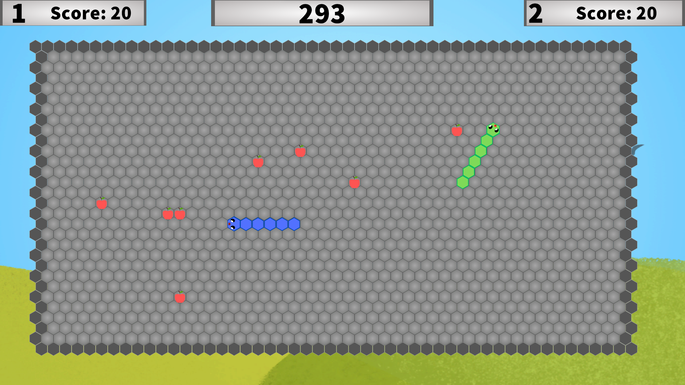
- 俄罗斯方块(Tetris)  （我知道这个英文名来自于"四"这个单词，但是很难找到更好的英文名）
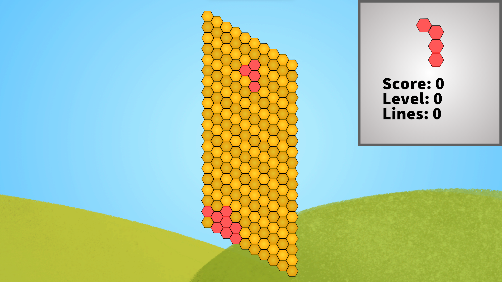
- 扫雷(Mine Clearer)
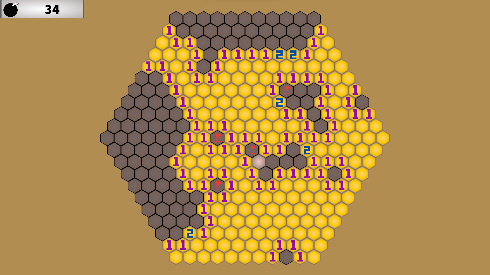
- 泡泡堂(Bnb)
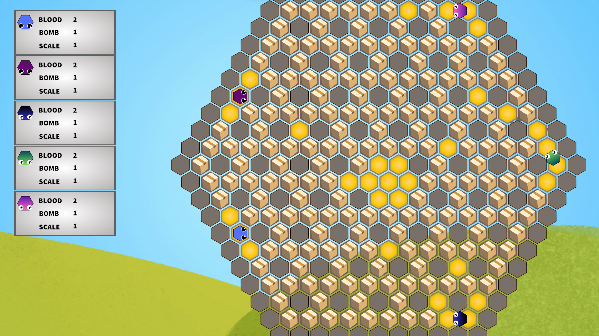
## 开发环境
- 操作系统：Windows11
- 开发软件：Unity 2022.3.17f1c1
## 团队分工
- 王冠仁：所有的游戏功能的代码实现。
- 靖博鳌：所有的美工设计与制作，音乐制作。
## 实现的功能
实现了四个小游戏的所有功能以及完整的UI

### 俄罗斯方块
包括8种方块，一个平行四边形网格，方块实现了下落，移动，旋转，旋转踢墙，升级后加快下落速度，以及仿照俄罗斯方块世锦赛制作的积分系统。前八个方块会以随机顺序遍历八种方块，之后的方块类型完全随机，有提示界面。

### 扫雷
就是完整的扫雷，但是六边形。第一下不会点到雷。有三种预设难度，也可以自己定义雷区大小和雷数。
### 贪吃蛇 
开发了单人模式和双人模式，充分利用面向对象编程的优势。金币吃了会变长。设定了边界周围一定范围内不产生金币。单人模式场景中永远现存一个金币，碰到边界或自身判定死亡。双人模式碰到对方或边界会死亡。一方死亡游戏结束，存活的玩家获胜，有倒计时，到达时间限制后游戏结束，积分多的玩家获胜。
### 泡泡堂
地图上随机生成箱子，哪个箱子会开出什么物品也是随机的，共设置回血，提升炸弹量，提升爆炸范围，提升移动速度四种物品。

设置了多种模式，有双人pvp模式，单人1Player vs 1AI模式,1player vs 3AI模式，2player vs 3AI模式。

有AI的模式又分三种难度。AI使用了复杂的算法，困难难度可以做到比较无敌的AI
## 完整的UI系统
分为进入界面，选关界面，每个关卡的设置界面，暂停界面，结束界面，说明书界面，每个界面都经过了精心地美工设计。

# Hexagon六边形 软件使用说明书
游戏内的说明书上有简要介绍
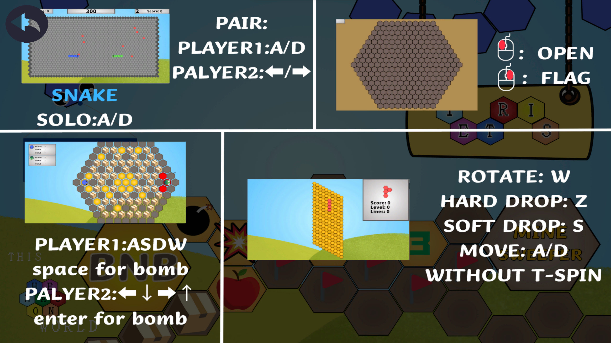
1. 进入开始界面
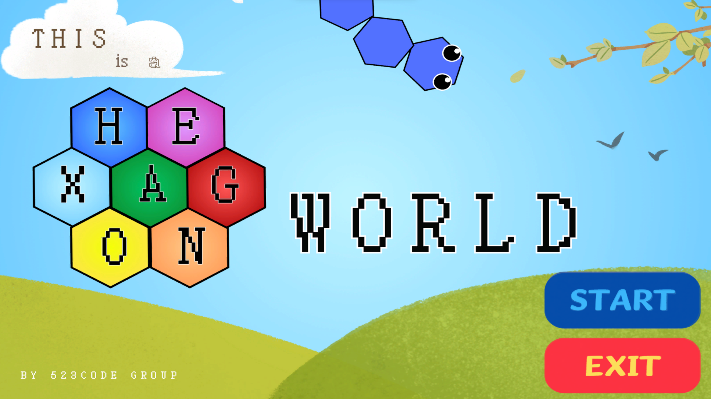
2. 点击Start进入选择界面，点击Exit退出游戏
   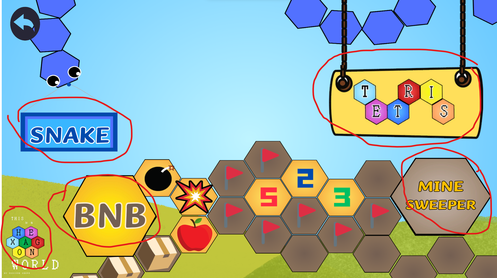
   这里出现五处按钮，分别对对应四个游戏和说明书
## 贪吃蛇(Snake)
分为单人模式(Solo)和双人模式(Pair)。
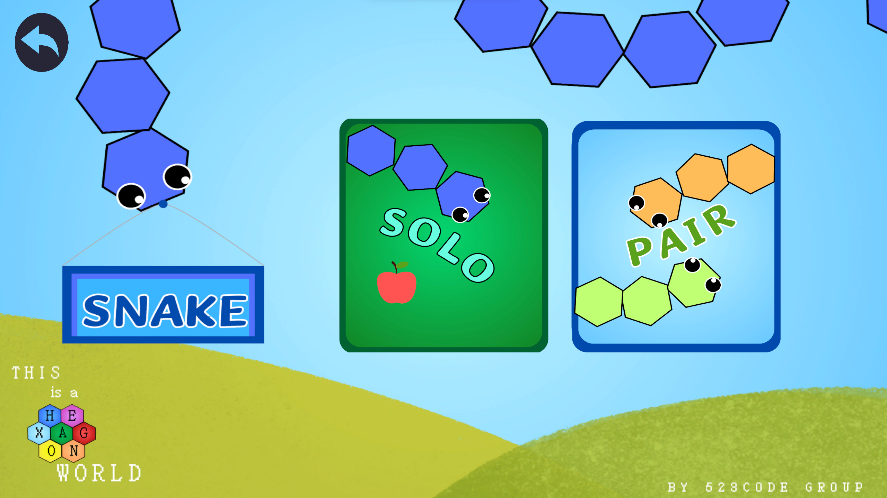
单人模式中按A键左转60°，按D键右转60°，注意这里的左右都是以蛇为参考系，而非屏幕的左右（初玩可能有一些难度，略微熟练后游戏体验还是很不错的，可以达到益智的效果）。

双人模式玩家1通过A、D键控制，玩家2通过左右键控制。

单人模式撞到自身和边界会死，双人游戏撞到自身不会死，撞到对方和边界会死。吃到一个金币会增加10分的积分。单人游戏不限时，双人游戏限时300秒。有一方死亡则对方获胜。达到时间后积分高者获胜。
## 俄罗斯方块(Tetris)
按AD键左右移动，长按快速移动，按W键逆时针旋转60°，按S键下降一格。长按S加速下降。按Z键直接落地。
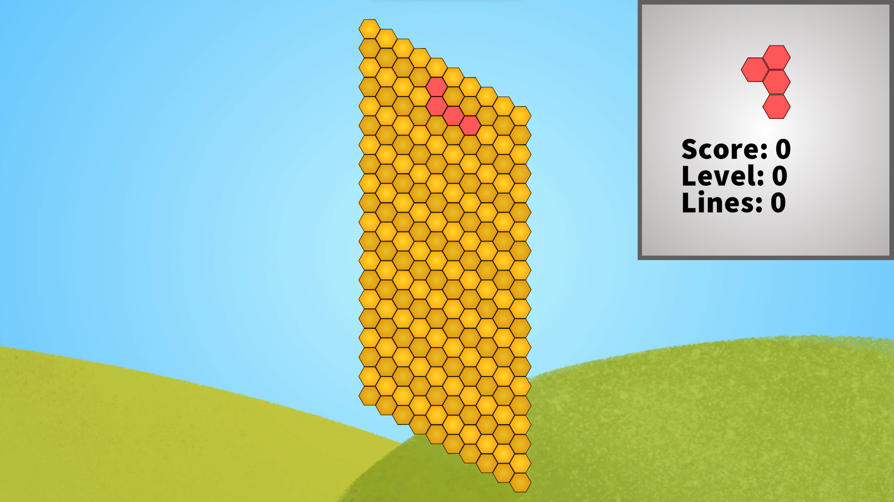
左上右下填满一行后会消去，同时加分。同时消去的行数越多，每一行加分越高。

## 扫雷(Mine Clearer)
进入之后可以选择难度或自定义难度
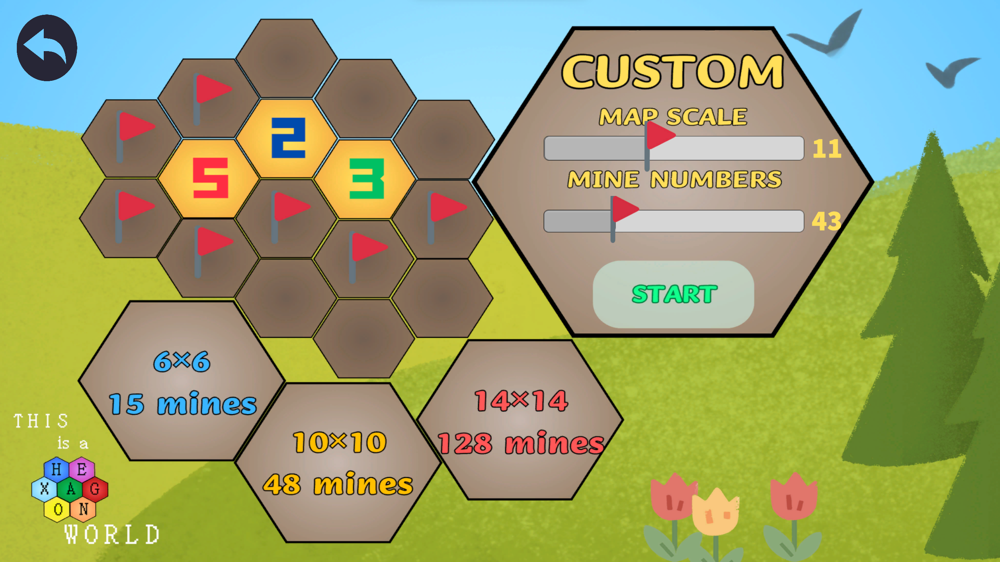
左键点击掀开，右键单击插旗。点到雷即死。将所有非雷方块解开后判定胜利。
## 泡泡堂(Bnb)
设置了多种模式，有双人pvp模式，单人1Player vs 1AI模式,1player vs 3AI模式，2player vs 3AI模式。有AI的模式设置了三种难度。
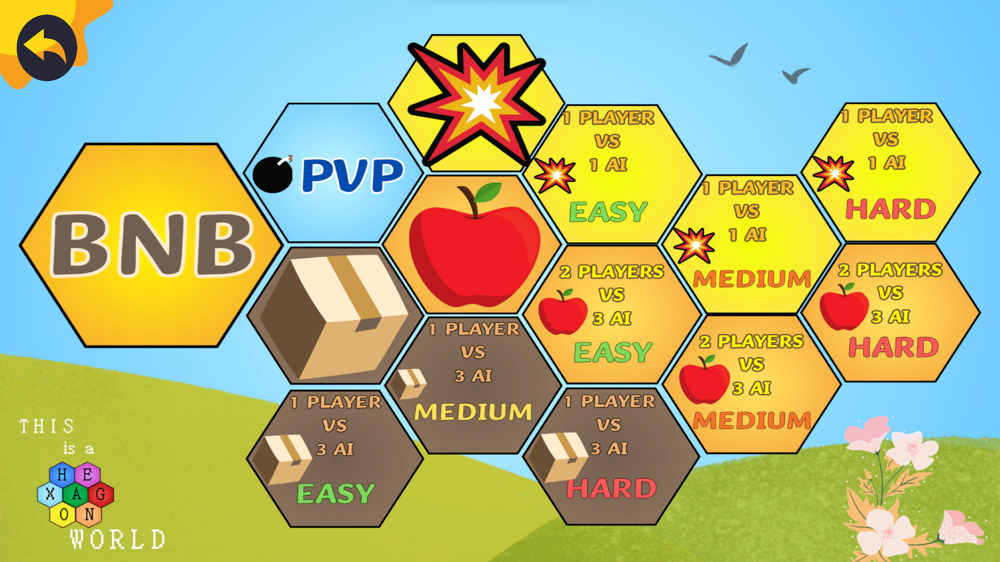
两玩家分别用WASD和上下左右键控制。同时按左上键可以向上偏左30°的方向行走，其他以此类推，更适合网格方向。玩家1按空格键放置炸弹，玩家2按右回车键放置炸弹。被炸弹炸到会减一滴血（不论是对方还是己方炸弹）。炸弹爆炸会向六个方向延伸BombScale距离。箱子可以被炸掉，墙不会被炸掉，并且会挡住炸弹。箱子炸开后可能产生道具，有增加同时放置的炸弹数量、增加移动速度、增加血量、增加爆炸范围等道具。

除了炸弹放置者之外的其他玩家可以推走炸弹，炸弹放置者会被炸弹挡住。

当对战一方全部死亡时游戏结束。
